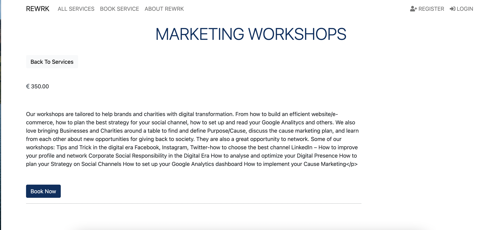

# Rewrk

## Project 4 - Full Stack Toolkit

# Overview

Rewrk is a digital service provider where customers can come and view each of the services offered by Rewrk. Customers are able to read case studies about businesses who have utilised Rewrk’s services to ensure they are a credible provider. 

Site administrators have the ability to add, remove or update services and case studies to ensure the most up to date content is being presented to customers. Customers are able to create an account with Rewrk to view booked services and become part of a Rewrk community. 

This combined with an intuitive interface aims to deliver a smooth and enjoyable customer experience to maximise repeat visits to the site

The live site can be found <a href="https://rewrk-ms4.herokuapp.com/" target="_blank" rel="noopener">here</a>. (Note: Right click on link to open a new tab).

# Strategy 

During the pandemic a lot of local businesses were forced to close their doors for months. Prior to this many businesses did not have e-commerce websites or even social media accounts and when they were forced to close they were unable to reach any of their customers. 

Rewkrs aim is to provide these businesses with access to digital services at reasonable prices. Many web development companies charge high prices that can be out of reach to local, small businesses. Rewkrs aim is not only to create a digital presence for the business but also to educate business owners on how to continue to grow their business online long after working with Rewrk by creating a community that receives monthly emails from Rewrk. 

# Logins
* Admin Login
    * Username: Admin
    * Password: Password1@

* Registered User
    * Username: Test13
    * Password: Password1@

# Table of Contents
1. [UX](https://github.com/Aoibhinn/Rewrk_MS4#ux)
   * [Website owner goals](https://github.com/Aoibhinn/Rewrk_MS4#website-owner-business-goals)
   * [User stories](https://github.com/Aoibhinn/Rewrk_MS4#user-stories)
   * [Wireframes](https://github.com/Aoibhinn/Rewrk_MS4#wireframes)
2. [Features](https://github.com/Aoibhinn/Rewrk_MS4#features)
3. [Database Schema](https://github.com/Aoibhinn/Rewrk_MS4#database-schema)
4. [Technologies Used](https://github.com/Aoibhinn/Rewrk_MS4#technologies-used)
5. [Testing](https://github.com/Aoibhinn/Rewrk_MS4#testing)
    * [Functionality testing](https://github.com/Aoibhinn/Rewrk_MS4#functionality-testing)
    * [Code Validation](https://github.com/Aoibhinn/Rewrk_MS4#code-validation)
    * [Compatibility testing](https://github.com/Aoibhinn/Rewrk_MS4#compatibility-testing)
    * [Performance testing](https://github.com/Aoibhinn/Rewrk_MS4#performance-testing)
    * [User stories testing](https://github.com/Aoibhinn/Rewrk_MS4#user-stories-testing)
    * [Known bugs](https://github.com/Aoibhinn/Rewrk_MS4#known-bugs)
6. [Deployment](https://github.com/Aoibhinn/Rewrk_MS4#deployment)
7. [Acknowledgments](https://github.com/Aoibhinn/Rewrk_MS4#acknowledgements)

# UX
## Website owner business goals
* I want my visitors to be able to navigate my website intuitively and easily.
* I would like the website to be informative for visitors.
* I would like to manage the information about the our services.
* I would like to be able to add draft services so that I can finish writing the content later.
* I would like to edit and update client case studies.
* I would like to be able to add draft case studies so that I can finish writing the content later.
* I would like to add bookings to my customer's profile so they can keep of track of what they have booked.
* I would like to collect the details of customers who are intrested in our services.

## User Stories
### New user goals:
* I want to find information about Rewrks services
* I want to read case studies about past project.
* I want to book a service with Rewrk.
### Returning user goals:
* I would like to view the available services.
* I would like to be able to book a services.
* I would like to view booked services on my profile.

[Back to Table of Contents](https://github.com/Aoibhinn/Rewrk_MS4#table-of-contents)

## Wireframes
I used Balsamiq to create the wireframes.
Wireframes were not created for the Service, ServiceDetail, Login  pages as the basic design is similar to other form styled pages.

* Home page 

* service detail

* service booking

* login

* create account

* Home page mobile view

[Back to Table of Contents](https://github.com/Aoibhinn/Rewrk_MS4#table-of-contents)

## Design
### Colors
The main colors used in this project:
* Font and Accent color: #4C6FBF blue
* Background color: Black #003060; navy

### Fonts
Sans-Serif is used as the main font. I did not feel it necessary to change the default font type as Sans-Serif is an easy font to read and displays well throughout the site.

### Images
Images were sourced from canva.com

[Back to Table of Contents](https://github.com/Aoibhinn/Rewrk_MS4#table-of-contents)

# Features
## Existing Features
### Navigation Bar
   * Featured on all pages is a fully responsive navigation bar that has links to all pages (Home, All Services, Book Service and My Bookings).
   * If the user is not logged in then there are two additional links available available (Register and Login).
   * If the user is logged in then the Register, Login links no longer display. The user can now Logout or view their bookings.
   * A confirmation message displays when the user logs in.

### Footer
   * Featured on all pages is a fully responsive footer that has links to all pages (All Services, Book Service, Case studies and Profile).
   * If the user is logged in then a link to their profile will be available.

### Available Service section
   * On the home page the available services and an excerpt is displayed.
   * If the user clicks on a specific service they can view the full description of the service information. At the bottom of the service detail page is a link to the service booking page.

  
### Booking form
* This page invites the user to submit their interest in booking a specific service.
* On submission of the form the user is provided with a confirmation message.

### Case Studies
* This page show cases previous project Rewrk have worked on and the customer success stories.
* A user can select individual case studies to read about projects.

## Future features
* A Calendar on the create booking page for logged in users which shows which days are booked and which are available for booking.
* Cancel and edit bookings from profile
* Payment method 

# Database Schema
### User Profile model
* Django's user and admin model was utilised.

### Service App

### Case Study App

### Customer app for viewing booked services

# Technologies Used:
### Programming Languages:
* CSS, HTML, Python, and Django.
### Database framework
* Postgres.
### Git
* Git was used for version control by utilizing the Gitpod terminal to commit to Git and Push to GitHub.
### Github
* GitHub was used to store the projects code after being pushed from Git.
### Bootstrap 5
* Bootstrap was used to for design and to make the website responsive.
### Balsamiq
* Balsamiq was used to create the wireframes during the design process.

[Back to Table of Contents](https://github.com/Aoibhinn/Rewrk_MS4#table-of-contents)

# Testing
## Functionality Testing
### Manual testing
* I used Google Chrome developer tools throughout the development process for testing and solving problems with style and display issues.
* I used Github Project and Issues to track tasks. After each task completion, I would fully test it before moving on to the next task.
* All links were tested multiple times during the development process and again once the project was completed to ensure that all pages were linked correctly.
* All Forms and form elements were tested to ensure that they work as they should, with user feedback on errors as well as user feedback on successful submission.

## Code Validation

## Code Validation
**1. CSS Validation using <a href="https://jigsaw.w3.org/css-validator/#validate_by_input" target="_blank" rel="noopener">W3C CSS Validator Services</a>.**

No errors were found in the style.css

**2. <a href="http://pep8online.com/">PEP8</a> was used to test the Python code**

All Python files were tested with PEP8, with no errors found.
There were some pylint errors in gitpod regarding missing docstrings, these errors were fixed during development.

## Compatibility Testing
* The website was tested on Google Chrome, and apple cellphones.
* The website was viewed on a variety of device sizes such as Desktop, Iphone11, I also used the responsive function when inspecting the pages to view various sizes. 

[Back to Table of Contents](https://github.com/Aoibhinn/Rewrk_MS4#table-of-contents)

## User Stories testing
### As a customer/potential customer
1. I want to find information about the various services.
    * Users can do this on the home page, if they want more detailed information they can click on the service they are interested in and find more information.

    
    

2. I want to read about past projects Rewrk have worked with.
    * Users can read about past projects to learn more about was Rewrk has successfully achieved for their past clients.
    
    

3. I want to book one of Rewkrs services
    * Users can leave their details via Rewkrs service booking form for a member of the team to get back to them.
    

4. I want to register on the website
    * Users can register using the register link.
    

5. I was to view the services I have booked with Rewrk
    * Users can register an account on Rewrk and an admin member can add bookings to their profiles
    

### As an Admin user:

1. I would like to be able to add draft services so that I can finish writing the content later.
    * The website owner can add a draft service which will not be published to the site until the status is changed to published.
    

2. I would like to manage Rewrks case studies 
    * The admin panel allows the website owner to amend and update case studies.
    

3. I want to be able to add booked services to customer accounts
    * The admin panel allows admin users to add bookings to customer registered accounts
    

[Back to Table of Contents](https://github.com/Aoibhinn/Rewrk_MS4#table-of-contents)

# Deployment
The project was deployed to GitHub Pages using the following steps, I used Gitpod as a development environment where I commited all changes to git version control system. I used the push command in Gitpod to save changes into GitHub.

### Deployment to Heroku
Before creating a Heroku app make sure your project has these two files:

* requirements.txt - You can create one by using <code>pip3 freeze --local > requirements.txt</code>
* Procfile - You can create one by using echo web: <code>python run.py > Procfile</code>

### Create application:

1. Navigate to Heroku's site <a href="https://id.heroku.com/login" target="_blank" rel="noopener">here</a>. (Note: Right click on link to open a new tab).
2. Register and/or Login as applicable.
3. Click on the new button in the top right and select "Create new app".
4. Enter the app name and region closest to you.
5. Click the create app button.

### Set environment variables:

1. Click on the settings tab and then click "Reveal config vars".
2. Config variables added throughout project:
(add image of variables)

### Setting up database in deployment

1. Temporarily add the <code>DATABASE_URL</code> to <code>settings.py</code>:

    <code>DATABASES = {
'default': dj_database_url.parse('your_postgres_database_url')
}</code>

2. Migrate the data from development to production version.

    * To migrate the database models in the project to the Postgres database you can use the following command:

    <code>python3 manage.py migrate</code>

3. You will then need a superuser for the Postgres database too. To create one you can use the following command:

    <code>python3 manage.py createsuperuser</code>

4. Remove the Postgres database URL from settings.py as this should not in any case be deployed to GitHub for security reasons.

5. To connect your Heroku app to be deployed from a Github repository, you can follow these steps:

    * Open the heroku app page on the deploy tab and select GitHub - Connect to GitHub.
    * Sign into GitHub if not already.
    * A prompt to find a Github repository to connect to will then be displayed.
    * Enter the repository name for the project and click search.
    * Once the repository has been found, click the connect button.

6. Once you have your GitHub repository connected, without leaving deploy tab:

    * Under Automatic deploys section, choose the branch you want to deploy from and then click the "Enable Automatic Deploys" button.
    * To deploy your app to Heroku click the "Deploy Branch" button.

[Back to Table of Contents](https://github.com/Aoibhinn/Rewrk_MS4#table-of-contents)

## Acknowledgements
* My mentor for support, advice and feedback.
* The students on Slack for peer review and comments.
* Code Institute Tutor support for help with coding issues.
* My family and friends for their support, feedback and testing.

[Back to Table of Contents](https://github.com/Aoibhinn/Rewrk_MS4#table-of-contents)

