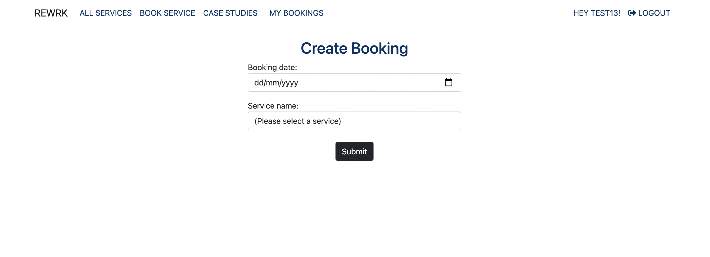

 

# Rewrk

Rewrk is a digital service provider where customers can come and view each of the services offered by Rewrk, developed for Milestone 4 as part of the Code Institute/UCD - Diploma in Software Development (E-commerce Applications)

There are two types of users, and I have set up accounts for both

An admin(administrator) user account has been set up with username/password of admin/Password1@
A regular(shopper) user account has been set up with username/password of Test13/Password1@

**View the live site [here](https://rewrk-ms4.herokuapp.com/)**
  
 

# Table of Contents
- [Rewrk](#Rewrk)
- [Project Overview](#project-overview)
- [UX](#ux)
  * [Strategy](#strategy)
  * [Structure](#structure)
    + [Website pages](#website-pages)
    + [Code Structure](#code-structure)
    + [Database](#database)
      - [Models](#models)
        * [Service Model](#service-model)
        * [Booking Model](#booking-model)
        * [Post Model](#post-model)
        * [Comment Model](#coment-model)
  * [Scope](#scope)
    + [User Stories](#user-stories)
  * [Skeleton](#skeleton)
    + [Wireframes](#wireframes)
  * [Surface](#surface)
    + [Color Palette](#color-palette)
    + [Typography](#typography)
- [Features](#features)
    + [Feature 1 Homepage and All Services](#feature-1-homepage-and-all-services)
      - [Description feature 1](#description-feature-1)
    + [Feature 2 External Service Booking Form](#feature-2-external-service-booking-form)
      - [Description feature 2](#description-feature-2)
    + [Feature 3 Case Studies & Case Study Details](#feature-3-case-studies-&-case-study-details)
      - [Description feature 3](#description-feature-3)
    + [Feature 4 Comments & Likes for Case Study Details](#feature-4-comments-&-likes-for-case-study-details)
      - [Description feature 4](#description-feature-4)
    + [Feature 5 My Bookings and Logged in Booking Form](#feature-5-my-bookings-and-logged-in-booking-form)
      - [Description feature 5](#description-feature-5)
    + [Feature 6 Services and Service Detail](#feature-6-services-and-service-detail)
      - [Description feature 6](#description-feature-6)
    + [Feature 7 Admin](#feature-7-admin)
      - [Description feature 7](#description-feature-9)
- [Technologies Used](#technologies-used)
  * [Languages](#languages)
  * [Libraries and other resources](#libraries-and-other-resources)
- [Testing](#testing)
- [Deployment](#deployment)
  * [Cloning using Github](#cloning-using-github)
  * [Forking using Github](#forking-using-github)
  * [Heroku and Postgres Database](#heroku-and-postgres-database)

# Project Overview

* This project is a website is for submission as milestone project 4 as part of the Code Institute - Diploma in Software * Development (Full stack) course.
* The website is deployed using Heroku pages at the following url: https://rewrk-ms4.herokuapp.com/
* The repository on GitHub that contains the website source code and assets is available at the following url:https://github.com/Aoibhinn/Rewrk_MS4
* The website was built with a responsive look and feel for desktop, tablet and mobile devices.

# UX
## Strategy 

The primary goal of the website from a site users perspective is as follows:

* To register for an account on the website and receive a notification successful registration.
* To login or logout from the website.
* Have a personalised booking page to view, edit and delete booked services
* View a list of services on the website.
* View an individual service detail(price, description)
* To book a serice without requiring an account
* To view case a list of case studies on the website 
* View individual case study details (comment, like, case study content)

## Structure
### Website pages
* I used the Bootstrap grid system throughout, which gave a consistent structure and responsive design "out of the box".
* Below are the main page's/features functionality wise, there are some others for password reset/verification etc. that are described in the user story section.
* All pages have a common look and feel and a common header/footer. On a tablet/mobile the look and feel is slightly different with a burger menu.
* These pages are described in more detail in the user stories section.

Page            |Description
:-------------         |:------------- 
Home/Services     | The Home/Service page displays a hero image with 2 call to action buttons, below are available services
External Service Booking Form          | The External Service Booking Form includes a form with fields a not logged in user can complete
Case Studies          | The Case Studies page includes published articles paginated by 6 articles per page
Case Study Detail | Displays individual case studies which includes content, comment and like funcationality
My Bookings     | A logged in user can view, delete, edit booked services
Create a Booking   | A logged in user can directly book a service by selecting date and service
Edit a Booking     | A logged in user can directly edit the date and service of an booked service
Delete a Booking   | A logged in user can directly delete a booking from 'my bookings'
Service Detail     | A normal user can few the details and price of a service and book via the external booking form, a logged in user can directly book a service
Register            | A user can register an account on the site with a valid email address
Log in              | A user can login with a valid username and password         
Log out             | A user can log out of their account

## Code Structure
The project is divided into a number of apps, as is built using the Django Framework.
The project was built on the I think before I blog, that was part of the project content.
The apps are described as follows:

* Case Studies/Posts (part of the original I think before I blog): This app contains functionality regarding the sites case studies.
* Services/Service (part of the original I think before I blog): This app contains functionality regarding the sites services.
* External Booking Form (New app): This app contains functionality enabling unauthenticated users to register interest in a service.
* My Bookings (New App): This app contains functionality enabling users to book,edit,delete and view bookings at an authenticated user.

To complement the apps there are:

- Rewrk : Containing settings.py(Settings) and urls.py(Website urls) for example
- templates: Containing the base.html, allauth(django authentication) and includes html files
- static: Base css and Javascript files
- manage.py: Main python file for starting the website
- README.md: Readme documentation
- Procfile: To run the application
- Requirements.txt: Containing the python libraries installed

## Database

### User Profile model
* Django's user and admin model was utilised.

### Service App

### Case Study App

### Customer app for viewing booked services

## Models

- The following models were created to represent the database model structure for the website

### Service Model
- The model contains the following fields: service_name, slug employee, featured_image, price, excerpt, description created_on, status, customer, id

### Booking Model
- The model contains the following fields: 
    user, service_name, booking_date

### Post Model
- The model contains the following fields:  employee, title, slug, content, excerpt, created_on,status, likes

### Comment Model
- The model contains the following fields: 
    post, name, email, body, created_on, approved

# Scope
## User Stories

The user stories for the regular user eg: "customer" (a potential or existing customer) are described as follows:

### User Stories feature 2 External Service Booking Form
* User Story 2.1: As a website visitor I would like to book a service with Rewrk without creating an account
* User Story 2.2: As a website visitor I would to be notified if I have not completed the form accurately and in full
* User Story 2.3: As a website visitor I would like to be notified that I have completed the form accurately and in full via a confirmation message
### User Stories feature 3 - Case Studies & Case Study Details
* User Story 3.1: As a website visitor/logged in user I would like to view all published articles from rewrk along with the date, number of comments, and likes each of the received.
* User Story 3.2: As a website visitor/logged in user I would like case studies to be paginated so it does not take the page a long time to load
* User Story 3.3: As a website visitor/logged in user I would like to view the contents of an individual case study along with it's comments, likes, date of publication.
### User Stories feature 4 - Comments & Likes for Case Study Details
* User Story 4.1: As a logged in user I would like to view the number of likes and comments under a case study
* User Story 4.2: As a logged in user I would like to be able to input a comment into the comment text box
* User Story 4.3: As a logged in user I would like to be able to submit my comment under a case study and receive confirmation that it has been successfully submitted
* User Story 4.4: As a logged in user I would like to be able to like a case study
* User Story 4.5: As an admin user I would like to be able to view all comments under case studies
* User Story 4.6: As a logged in user I would like to be able to view individual case study comments and approve comments to be publised
* User Story 4.7: As a logged in user I would like to be able to view my approved comment under a case study
* User Story 4.1: As a unlogged in user I should not be able to submit a comment to a case study
### User Stories feature 5 - My Bookings and Logged in Booking
* User Story 5.1: As a logged in user I would like to be able to view all of my bookings I've currently made with rewrk
* User Story 5.2: As a logged in user I would like to be able to book a service directly from my booking page
* User Story 5.3: As a logged in user I would like to be able to select a date and service I would like to book with rewrk
* User Story 5.4: As a logged in user I would like to receive a confirmation message the service has been successfully booked and view the service I just booked
* User Story 5.5: As a logged in user I would like to to be able to edit a service I have booked
* User Story 5.5: As a logged in user I would like to to be able to delete a service I have booked
### User Stories feature 6 - Services and Service Detail
* User Story 6.1: As a normal/logged in user I want to be able to view all service rewrk has available
* User Story 6.2: As a normal/logged in user I want to be able to view the details and price of an available service
* User Story 6.2: As a normal I want to be able to book a service without having to create an account with rewrk
* User Story 6.4: As a logged in user I want to be able to create a booking from a service and be redirected back to 'my bookings' tab

[Back to Table of Contents](https://github.com/Aoibhinn/Rewrk_MS4#table-of-contents)

## Skeleton
### Wireframes
I used Balsamiq to create the wireframes.
Wireframes were not created for the Service, ServiceDetail, Login  pages as the basic design is similar to other form styled pages.

## Surface
### Color Palette
I have gone for a simple and minimal design for the website, with predominately Navy, Blue and white font colours
There are five colours in the color palette
* Font and Accent color: #4C6FBF blue
* Background color: Black #003060; navy
* #ffff - White for background colours

### Typography
Sans-Serif is used as the main font. I did not feel it necessary to change the default font type as Sans-Serif is an easy font to read and displays well throughout the site.

The Sans-Serif font is the main font used throughout the whole website. This font is from the Google fonts library.

#Features

The screenshots below show mainly desktop images, the tablet and mobile images are displayed in the TESTING.MD file for each feature/user story

### Feature 1 Homepage and All Services
#### Description feature 1

- The homepage consists of an hero image with call to action buttons, a header/nav bar, available services and footer
- The header and footer is consistent across all pages
- The navigation bar is displayed with a logo on all pages with a All Services, Book Service, Case Studies, My Bookings, Register and Login
 

- The website links in the footer and account differ between a regular user and authenticated user
 
 

- The navigation bar is displayed on all pages with All Services, Book Service, Case Studies, My Bookings, Register and Login
 
 

### Feature 2 External Service Booking Form
#### Description feature 2
- Enables users to book a service without Rewrk without creating an account
 

- The form includes validation to ensure the form is completed in full with accurate information
 

- The form displays success message confirming 'A member of our team will be in touch with you shortly!
 

### Feature 3 Case Studies & Case Study Details
#### Description feature 3
- The case studies page enables users to view all published articles from rewrk along with the date, number of comments, and likes each of the received.
 

- The page is pagniated and will display a next button when posts exceeds 6
 

- The case study detail page to enables users to view title, time, author, content, comments, postcomment and like functionality
 

### Feature 4 Comments & Likes for Case Study Details
#### Description feature 4
-  Comments, likes can be viewed on Case Study Detail pages and comments can be added under a case study if a user is authenticated
 

-  A success message is displayed notifying authenticated users their comment is awaiting approval
 

- A user can also choose to like a case study
 

- 'Leave a Comment' form is not available for logged out users
 

### Feature 5 My Bookings and Logged in Booking Form
#### Description feature 5
-  The my bookings tab enables authenticated users to view all of my bookings I've currently made with rewrk.
 
 

- An authenticated user can directly book a service from My Bookings
 

- A booking can be edited for the date and service by an authenticated user 
 

- An authenticated user can delete a booked service 
 

### Feature 6 Services and Service Detail
#### Description feature 6
-  The Services and Service Detail feature enables users to view the price and details of available services
 
 

- An authenticated user can directly book a service from My Bookings
 

- Depending on whether the user is authenticated or not they will be redirected to a form to book a service
 

# Technologies Used

## Languages 

- HTML (https://en.wikipedia.org/wiki/HTML)
    - The project uses html to build the relevant pages
- CSS (https://en.wikipedia.org/wiki/CSS)
    - The project uses CSS to style the relevant pages
- Django (https://www.djangoproject.com/)
    - Django is the framework used in this project
    - The Django templating language was used to render pages
- Python v3.9 (https://www.python.org/)

    - Python was used for server side coding on the project, a number of libraries were also used(The requirements.txt file contains this list):
        - asgiref==3.4.1
        - cloudinary==1.28.0
        - dj-database-url==0.5.0
        - dj3-cloudinary-storage==0.0.6
        - Django==3.2.9
        - django-summernote==0.8.20.0
        - gunicorn==20.1.0
        - psycopg2==2.9.2
        - pytz==2021.3
        - sqlparse==0.4.2
        - django-allauth==0.49.0
        - django-crispy-forms==1.14.0

## Libraries and other resources
- Bootstrap 5.0 (https://getbootstrap.com/docs/5.0)
    - The project uses the bootstrap library for some UI components in the website (Buttons, Card, Carousel, Modal, Pagination, Navbar)
- Postgres (https://www.postgresql.org/)
  - The deployed project on Heroku uses a Postgres database
- SQLLite (https://www.sqlite.org/index.html)
  - The database uses in local development was a SQLLite database
- Gitpod (https://gitpod.io/)
    - Gitpod was used as an IDE for the project
- Github (https://github.com/)
    - GitHub was used to store the project code in a repository
- Google Fonts (https://fonts.google.com/)
    - Google font Poppins was used as the website font
- Balsamiq (https://balsamiq.com/)
    - Balsamiq was used to create the website wireframes
- Font Awesome (https://fontawesome.com/)
    - Font awesome was used to provide the relevant fonts/icons for the website
- CSS Validation Service (https://jigsaw.w3.org/css-validator/)
   - CSS validation service for validation the css in the project  
- HTML Markup Validation Service (https://validator.w3.org/)   
    - HTML validation service for validation the css in the project  
- Chrome dev tools (https://developers.google.com/web/tools/chrome-devtools)
    - For troubleshooting and debugging of the project code
- PEP8 (https://www.python.org/dev/peps/pep-0008/)
  - I used the pep8 code analysis plugin in Pycharm to check for pep8 errors

# Testing
The testing information and results for this project are documented in [TESTING.md](TESTING.md)

# Deployment
The project was deployed to GitHub Pages using the following steps, I used Gitpod as a development environment where I commited all changes to git version control system. I used the push command in Gitpod to save changes into GitHub.

## Cloning using Github
[Repository Link](https://github.com/Aoibhinn/Rewrk_MS4)

* Log in to Github.
* Access my repository using the above link.
* In the repository page select code next to Gitpod.
* Button, make sure HTTPS is selected.
* Click on the copy button on the right (Two overlapping squares)
* Open a new workspace in Gitpod.
* Once the workspace loads in the terminal type. git clone https://github.com/aoibhinn/rewrk_ms4

## Forking using Github
* You can contribute to this project without affecting the main branch with the following steps.
* Navigate to github repositores select this repository.
* On the right of the repository name you will find the fork button next to the star and watch buttons.
* Pressing said button will create a copy for you to use.

### Deployment to Heroku
Before creating a Heroku app make sure your project has these two files:

* requirements.txt - You can create one by using <code>pip3 freeze --local > requirements.txt</code>
* Procfile - You can create one by using echo web: <code>python run.py > Procfile</code>

### Create application:

1. Navigate to Heroku's site <a href="https://id.heroku.com/login" target="_blank" rel="noopener">here</a>. (Note: Right click on link to open a new tab).
2. Register and/or Login as applicable.
3. Click on the new button in the top right and select "Create new app".
4. Enter the app name and region closest to you.
5. Click the create app button.

### Set environment variables:

1. Click on the settings tab and then click "Reveal config vars".
2. Config variables added throughout project:
[Config Vars](readme/testing/heroku_config_vards.png)

### Setting up database in deployment

1. Temporarily add the <code>DATABASE_URL</code> to <code>settings.py</code>:

    <code>DATABASES = {
'default': dj_database_url.parse('your_postgres_database_url')
}</code>

2. Migrate the data from development to production version.

    * To migrate the database models in the project to the Postgres database you can use the following command:

    <code>python3 manage.py migrate</code>

3. You will then need a superuser for the Postgres database too. To create one you can use the following command:

    <code>python3 manage.py createsuperuser</code>

4. Remove the Postgres database URL from settings.py as this should not in any case be deployed to GitHub for security reasons.

5. To connect your Heroku app to be deployed from a Github repository, you can follow these steps:

    * Open the heroku app page on the deploy tab and select GitHub - Connect to GitHub.
    * Sign into GitHub if not already.
    * A prompt to find a Github repository to connect to will then be displayed.
    * Enter the repository name for the project and click search.
    * Once the repository has been found, click the connect button.

6. Once you have your GitHub repository connected, without leaving deploy tab:

    * Under Automatic deploys section, choose the branch you want to deploy from and then click the "Enable Automatic Deploys" button.
    * To deploy your app to Heroku click the "Deploy Branch" button.

## Acknowledgements
* My mentor for support, advice and feedback.
* The students on Slack for peer review and comments.
* Code Institute Tutor support for help with coding issues.
* My family and friends for their support, feedback and testing.

[Back to Table of Contents](https://github.com/Aoibhinn/Rewrk_MS4#table-of-contents)

